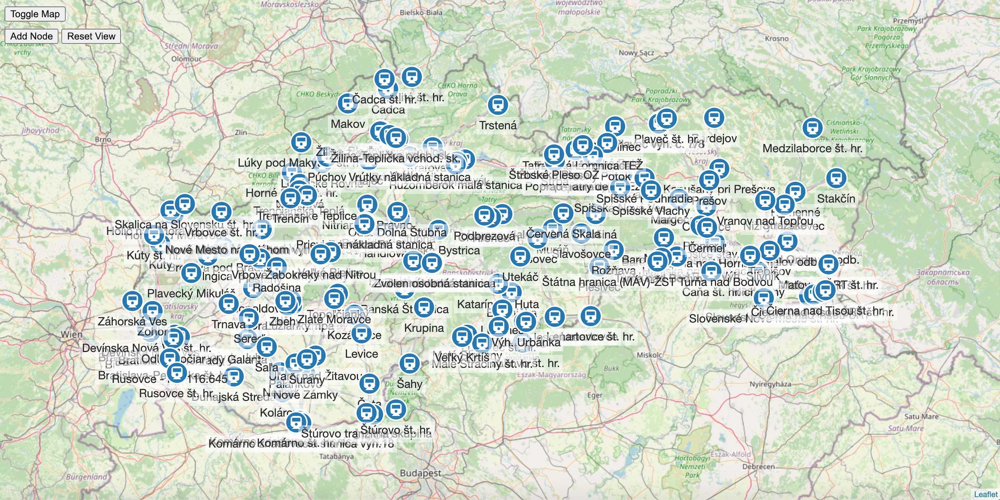

# cytoscape-leaflet

Based on [cytoscape-mapbox-gl](https://zakjan.github.io/cytoscape-mapbox-gl/) by [zakjan](https://github.com/zakjan/)

Leaflet plugin for Cytoscape

[Demo](https://aleksplus.github.io/cytoscape-leaflet/index.html)



Compatible with Leaflet v1.3.

**Compatible not tested**, but original plugin for mabox-gl is compatible with Cytoscape plugins:

- [cytoscape-edgehandles](https://github.com/cytoscape/cytoscape.js-edgehandles)
- [cytoscape-lasso](https://github.com/zakjan/cytoscape-lasso)

Incompatible with Cytoscape plugins:

- cytoscape-panzoom
  - disable with `cy.panzoom('destroy')` after enabling `cy.L(...)`
  - [add map navigation control](#add-map-navigation-control)
  - enable with `cy.panzoom()` after calling `cyMap.destroy()`

## Install

```bash
npm install leaflet cytoscape-leaflet
yarn add leaflet cytoscape-leaflet
```

## Usage

The plugin exposes a single function, which should be used to register the plugin to Cytoscape.js.

```js
import cytoscape from 'cytoscape';
import cytoscapeLeaflet from 'cytoscape-leaflet';

cytoscape.use(cytoscapeLeaflet);
```

Plain HTML/JS has the extension registered for you automatically.

### API

```js
import {LatLng} from "leaflet";

export interface MapOptions {
  getPosition: (node: cytoscape.NodeSingular) => LatLng;
  setPosition?: (node: cytoscape.NodeSingular, lngLat: LatLng) => void;
  animate?: boolean;
  animationDuration?: number;
}

const cyMap = cy.L(mapOptions: L.MapOptions, options: MapOptions);
```

- `mapOptions` - see [Leaflet docs](https://leafletjs.com/reference-1.3.4.html#map-option) for detailed documentation
- `options`
  - `getPosition` - function, should return node position, **required**
  - `setPosition` - function, should save the node position
  - `animate` - animate the transition between graph and map mode
  - `animateDuration` - animation duration for the transition between graph and map mode

If no `setPosition` option is provided, it's important to disable node dragging with Cytoscape methods, e.g. with `cy.autoungrabify(true)`.

If node dragging is kept enabled and no `setPosition` option is provided, or `setPosition` returns without saving, node position is reverted back to the original position after node dragging is finished. This behavior can be also used for cancelling.

### Basic

```js
cy.autoungrabify(true); // disable node dragging
const cyMap = cy.L(..., {
  getPosition: (node) => {
    const lng = node.data('lng');
    const lat = node.data('lat');
    return typeof lng === "number" && typeof lat === "number"
      ? {lat, lng}
      : null;
  }
});
```

### Node dragging enabled

```js
const cyMap = cy.L(..., {
  getPosition: (node) => {
    const lng = node.data('lng');
    const lat = node.data('lat');
    return typeof lng === "number" && typeof lat === "number"
      ? {lat, lng}
      : null;
  },
  setPosition: (node, lngLat) => {
    node.data('lng', lngLat.lng);
    node.data('lat', lngLat.lat);
  }
});
```

### Use raster basemap layer

```js
cyMap = cy.L({
  minZoom: 0,
  maxZoom: 18,
}, {
  getPosition: (node) => {
    const lng = node.data('lng');
    const lat = node.data('lat');
    return typeof lng === "number" && typeof lat === "number"
      ? {lat, lng}
      : null;
  },
  setPosition: (node, lngLat) => {
    node.data('lng', lngLat.lng);
    node.data('lat', lngLat.lat);
    console.log(node.id(), lngLat);
  },
  animate: true,
  animationDuration: 1000,
});
L.tileLayer('//{s}.tile.openstreetmap.org/{z}/{x}/{y}.png', {
  minZoom: 0,
  maxZoom: 18,
}).addTo(cyMap.map);
```

OpenStreetMap tiles are not recommended for heavy use. See [OpenStreetMap Tile Usage Policy](https://operations.osmfoundation.org/policies/tiles/) for details. See [Tile servers at OpenStreetMap wiki](https://wiki.openstreetmap.org/wiki/Tile_servers) for possible alternatives, or consider commercial alternatives such as [Mapbox](https://studio.mapbox.com/), [Maptiler](https://cloud.maptiler.com/), or running your own tile server.


### Fit map to nodes

```js
cyMap.fit(nodes = this.cy.nodes(), options)
```

- `nodes` - `cytoscape.NodeCollection`, the collection to fit to (default all nodes)
- `options` - `L.FitBoundsOptions`, see [Mapbox GL JS docs](https://docs.mapbox.com/mapbox-gl-js/api/map/#map#fitbounds) for detailed documentation

### Access Leaflet instance

```js
cyMap.map
```

### Destroy

```js
cy.autoungrabify(false); // enable node dragging, if node dragging was disabled earlier with `cy.autoungrabify(true)`
cyMap.destroy();
```
